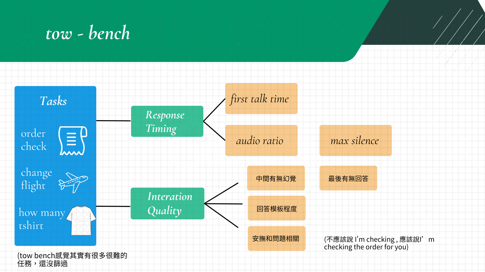

# Gemini Live Tool-Wait Benchmark

This repository contains experiments for probing Gemini Live native tool calling while a tool result is pending. The main research question is:

> Can a voice assistant naturally keep a user engaged while waiting for a native tool result, without hallucinating the result, becoming unstable, or failing to answer after the final tool response?

The current benchmark is a controlled tau-bench-style order-status task. It is intentionally simpler than the full tau-bench retail and airline environments so that timing, audio, tool-response behavior, and instability can be measured cleanly.



## What This Measures

The benchmark focuses on two broad dimensions.

### Response Timing

These metrics describe how the assistant behaves over time while the tool is pending.

- **First talk time**: how long the user waits before hearing assistant speech.
- **Audio occupancy ratio**: how much of the waiting window contains assistant audio.
- **Max silence gap**: the longest silent interval before the final tool result.
- **Post-final answer latency**: how long after the final tool response the assistant begins answering.
- **1008 / 1011 stability**: whether Live API sessions close with instability or server errors.

Relevant code:

- Benchmark runner: [src/tau-live-tool-formal-benchmark.ts](src/tau-live-tool-formal-benchmark.ts)
- Main tick/native probe: [src/tau-live-tool-tick-factor-probe.ts](src/tau-live-tool-tick-factor-probe.ts)
- Audio/timeline postprocess: [scripts/postprocess_tau_live_tool_tick_factor_probe.py](scripts/postprocess_tau_live_tool_tick_factor_probe.py)
- Formal benchmark plots: [scripts/plot_tau_live_tool_formal_benchmark.py](scripts/plot_tau_live_tool_formal_benchmark.py)

### Interaction Quality

These metrics describe whether the assistant's speech is useful, grounded, and natural.

- **Waiting speech coverage**: whether the assistant produced meaningful pre-result waiting speech.
- **Waiting task relevance**: whether waiting speech refers to the actual user request, tool, or tool arguments.
- **Pre-result hallucination**: whether the assistant claims a concrete result before the tool result arrives.
- **Final answer correctness**: whether the final spoken answer is grounded in the tool result.
- **Group-BLEU lexical diversity**: whether different runs in the same condition use overly similar waiting wording.
- **Self-BLEU repetition**: whether one run repeats itself within its own waiting speech.

Relevant code:

- ASR pipeline: [scripts/asr_formal_benchmark.py](scripts/asr_formal_benchmark.py)
- LLM judge pipeline: [src/judge-formal-benchmark-gemma.ts](src/judge-formal-benchmark-gemma.ts)
- LLM judge plots: [scripts/plot_llm_judge_formal.py](scripts/plot_llm_judge_formal.py)
- Group-BLEU / self-BLEU lexical diversity: [scripts/analyze_waiting_self_bleu_diversity.py](scripts/analyze_waiting_self_bleu_diversity.py)

## Current Controlled Task

The formal benchmark currently uses one controlled order-status task.

User request:

```text
Can you check the status of my order #A123?
```

Native tool:

```text
get_order_details
```

Tool arguments:

```json
{ "order_id": "#A123" }
```

Final tool result:

```json
{
  "event_type": "TOOL_RESULT",
  "phase": "final",
  "has_final_answer": true,
  "answer_now": true,
  "tool_name": "get_order_details",
  "order_id": "#A123",
  "status": "shipped",
  "carrier": "UPS",
  "tracking_number": "1Z999AA10123456784",
  "estimated_delivery": "tomorrow"
}
```

Expected final answer content:

```text
Order #A123 has shipped. The carrier is UPS, the tracking number is 1Z999AA10123456784, and the estimated delivery is tomorrow.
```

## Formal Benchmark Design

The current formal run compares two conditions across four simulated tool latencies.

Conditions:

- `native_no_tick`: native tool call, no external pending tick.
- `external_single_tick`: native tool call plus one external pending status signal.

Latencies:

- `3000 ms`
- `5000 ms`
- `8000 ms`
- `12000 ms`

Tick policy:

- Only `external_single_tick` sends a tick.
- The tick is scheduled once at `4000 ms`.
- If the final result arrives before the tick time, the tick is skipped.
- The tick message is generic and does not contain the answer:

```text
The lookup is still running. No final result is available yet.
```

Final result policy:

- The final answer is delivered through native `sendToolResponse(...)`.
- The benchmark waits for a post-final observation window rather than closing immediately on early turn completion.

The most important result folder from the formal run is:

```text
result/2026-06-22_11-15-58-195_tau_live_tool_formal_benchmark
```

## Prompts

Prompt files are separated so no-tick and tick runs can evolve independently.

- No tick: [src/prompts/taw-no-tick.ts](src/prompts/taw-no-tick.ts)
- External tick: [src/prompts/taw-external-tick.ts](src/prompts/taw-external-tick.ts)
- Tool/pending-response stress tests: [src/prompts/taw-with-tick.ts](src/prompts/taw-with-tick.ts)

The current external-tick prompt tells the model:

- use the tool;
- do not invent the final answer before the tool result;
- treat pending status messages as generic runtime signals;
- speak task-aware waiting updates using the user request, tool, and tool arguments;
- read the final tool result aloud after it arrives.

## Setup

Install dependencies:

```bash
cd /user_data/gemini-live-check
npm install
```

Configure environment variables in an env file. By default, the scripts read:

```text
/user_data/angus_bench/.env
```

Expected variables:

```bash
GEMINI_API_KEY=your_real_api_key
GEMINI_LIVE_MODEL=gemini-3.1-flash-live-preview
```

You can override the env file:

```bash
GEMINI_ENV_FILE=/absolute/path/to/.env npm run check
```

Do not commit real API keys. Keep local env files outside git or ignored.

## Core Commands

Check Live API connectivity:

```bash
npm run check
```

Run the current formal benchmark:

```bash
npm run tau:live-tool-formal-benchmark
```

Run the tick-factor probe directly:

```bash
npm run tau:live-tool-tick-factor-probe
```

Run ASR on the formal benchmark result:

```bash
npm run asr:formal-benchmark
```

Run the Gemma LLM judge:

```bash
npm run judge:formal-gemma
```

Run word-level lexical diversity analysis:

```bash
npm run analyze:waiting-self-bleu
```

## Result Artifacts

Each attempt stores:

- raw Live API logs;
- timeline events;
- assistant audio;
- compressed audio;
- timeline audio with silence preserved;
- per-attempt summary JSON;
- timeline image.

The formal benchmark aggregates:

- `attempts.csv`
- `summary.csv`
- `final_comparison.md`
- `visualizations/*.png`
- ASR outputs:
  - `asr_segments.csv`
  - `asr_attempts.csv`
  - `asr_summary.json`
  - `asr_notes.md`
- LLM judge outputs:
  - `llm_judge_v3_attempts.csv`
  - `llm_judge_v3_summary.csv`
  - `llm_judge_v3_notes.md`
  - `llm_judge_v3_interpretation.md`
- lexical diversity outputs:
  - `lexical_diversity/waiting_group_bleu_summary.csv`
  - `lexical_diversity/waiting_self_bleu_summary.csv`
  - `lexical_diversity/waiting_cross_group_bleu_matrix.csv`

## Important Visualizations

Formal timing and stability:

- `visualizations/first_audio_time.png`
- `visualizations/audio_occupancy_ratio_from_start_to_final.png`
- `visualizations/audio_occupancy_ratio_from_tool_call_to_final.png`
- `visualizations/max_silent_gap_ms_from_start_to_final.png`
- `visualizations/post_final_answer_latency.png`
- `visualizations/stability_retry_overview.png`

LLM judge:

- `visualizations/llm_v3_final_core_answer_rate.png`
- `visualizations/llm_v3_waiting_speech_coverage.png`
- `visualizations/llm_v3_waiting_task_relevance_when_spoke.png`
- `visualizations/llm_v3_pre_result_hallucination_rate.png`
- `visualizations/llm_v3_waiting_diversity_score.png`

Lexical diversity:

- `visualizations/waiting_group_bleu_2.png`
- `visualizations/waiting_group_lexical_diversity_2.png`
- `visualizations/waiting_self_bleu_2.png`
- `visualizations/waiting_self_lexical_diversity_2.png`
- `visualizations/waiting_cross_group_bleu_2_matrix.png`

## Metric Notes

### Coverage vs Relevance

`waiting_speech_coverage` asks whether there was meaningful waiting speech before the final tool result.

`waiting_task_relevance_score` asks whether that waiting speech was task-aware. In v3, the judge is not shown tick content or external pending messages. It only sees the user request, tool context, and pre-result transcript.

If no waiting speech exists, relevance is `null`, not `0`.

### Group-BLEU vs Self-BLEU

`group-BLEU` compares waiting transcripts across different attempts in the same condition and latency. High group-BLEU means the model is using similar wording across runs.

`self-BLEU` compares waiting sentences inside one attempt. High self-BLEU means the assistant repeats itself within a single run.

### Strict Pre-result Splitting

The current ASR split is strict:

- segments fully before final tool response: `pre_result`;
- segments fully after final tool response: `post_final`;
- segments crossing the final time boundary: `overlaps_final`.

Some short-latency runs, especially `5000 ms`, produce waiting speech that overlaps the final result boundary. This can make strict pre-result coverage look lower than what the user actually heard.

Future work can use an LLM or better audio segmentation to split overlapping utterances more naturally.

## Relationship To tau-bench

The original tau-bench tasks in retail and airline are much more complex than this controlled probe. They often require:

- identifying a user;
- reading policies;
- searching products, orders, reservations, or flights;
- performing multi-step tool actions;
- satisfying preferences and fallback rules;
- sometimes returning explicit output values.

This repository currently uses a tau-bench-style single-tool order lookup because it isolates Live API waiting behavior. A natural next step is to adapt selected full tau-bench retail or airline tasks into Live-native multi-tool waiting benchmarks.

## Code Map

Live API checks and early tools:

- [src/check-live.ts](src/check-live.ts)
- [src/tool-bench.ts](src/tool-bench.ts)
- [src/tool-bench-batch.ts](src/tool-bench-batch.ts)

External wait baselines:

- [src/external-wait-bench.ts](src/external-wait-bench.ts)
- [src/external-wait-batch.ts](src/external-wait-batch.ts)
- [src/external-wait-tick-compare.ts](src/external-wait-tick-compare.ts)

Native tool-call probes:

- [src/tau-live-tool-1008-probe.ts](src/tau-live-tool-1008-probe.ts)
- [src/tau-live-tool-tick-factor-probe.ts](src/tau-live-tool-tick-factor-probe.ts)
- [src/tau-live-tool-final-handoff-probe.ts](src/tau-live-tool-final-handoff-probe.ts)
- [src/tau-live-tool-final-result-channel-probe.ts](src/tau-live-tool-final-result-channel-probe.ts)
- [src/tau-live-tool-waiting-speech-ablation-probe.ts](src/tau-live-tool-waiting-speech-ablation-probe.ts)

Formal benchmark:

- [src/tau-live-tool-formal-benchmark.ts](src/tau-live-tool-formal-benchmark.ts)

Postprocessing and analysis:

- [scripts/postprocess_tau_live_tool_tick_factor_probe.py](scripts/postprocess_tau_live_tool_tick_factor_probe.py)
- [scripts/plot_tau_live_tool_formal_benchmark.py](scripts/plot_tau_live_tool_formal_benchmark.py)
- [scripts/plot_tau_formal_overlay_gallery.py](scripts/plot_tau_formal_overlay_gallery.py)
- [scripts/recompute_tau_formal_activity_metrics.py](scripts/recompute_tau_formal_activity_metrics.py)
- [scripts/asr_formal_benchmark.py](scripts/asr_formal_benchmark.py)
- [scripts/plot_llm_judge_formal.py](scripts/plot_llm_judge_formal.py)
- [scripts/analyze_waiting_self_bleu_diversity.py](scripts/analyze_waiting_self_bleu_diversity.py)

## GitHub Publishing Notes

This folder is not currently a git repository. To publish it directly, initialize a repository or move it into an existing GitHub-backed checkout.

Recommended before publishing:

- keep `.env` files out of git;
- do not commit `node_modules/` or `dist/`;
- do not commit large `result/` or `logs/` folders unless you intentionally want the benchmark artifacts in the repository;
- consider publishing a small curated result sample and keeping large audio/result archives elsewhere.

